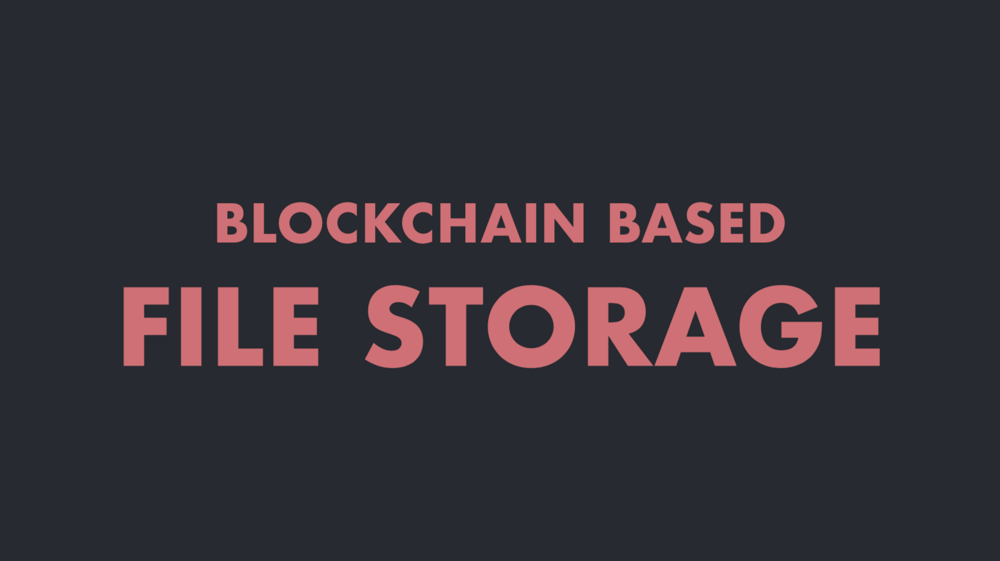
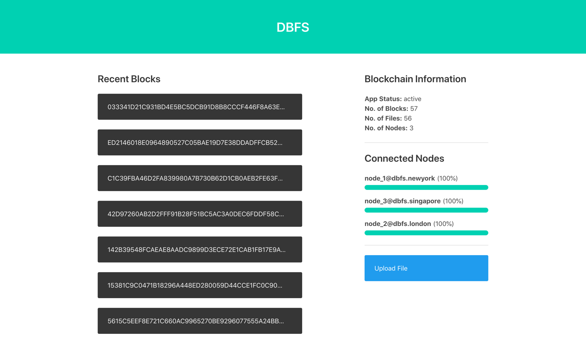
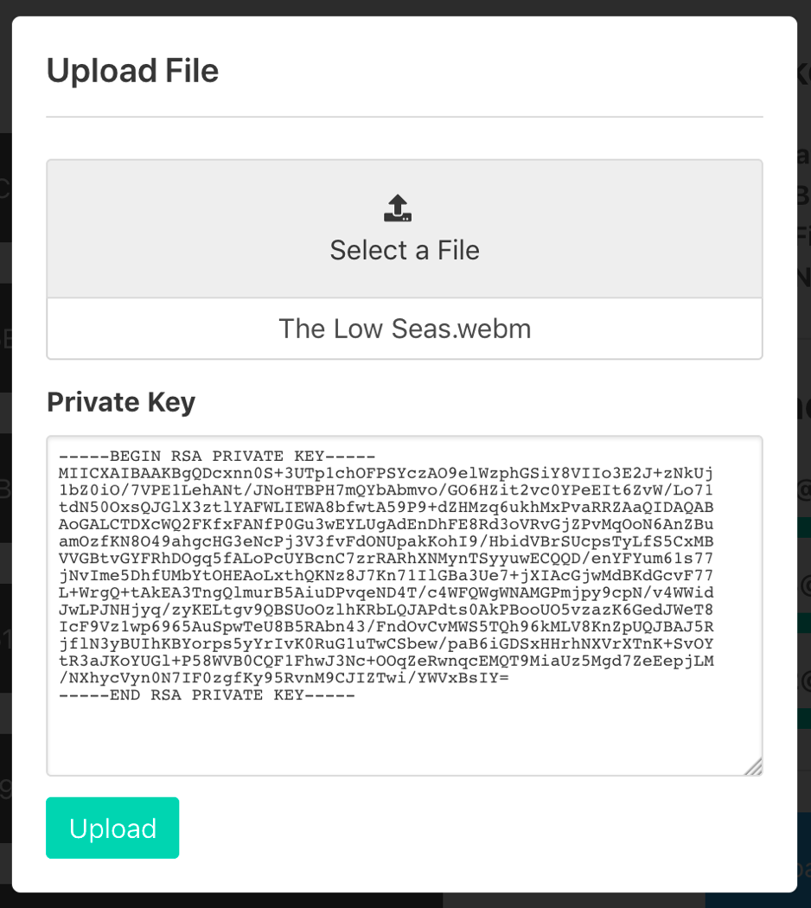
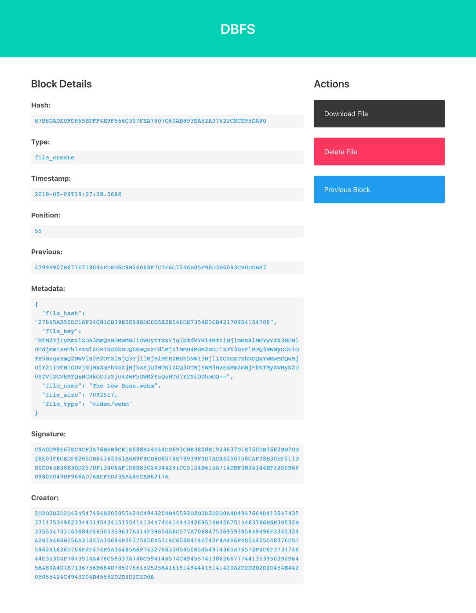

DBFS
====

> Distributed Blockchain-based File Storage in Elixir 📡

`DBFS` is an experiment to implement a (very naïve) distributed file storage service using a blockchain
in Elixir. With growing interest in Blockchains and Cryptocurrencies, I wanted to understand the complex
inner workings of Blockchains and their feasibility in the context of business applications. I started
by writing a [very simple Blockchain][blog-blockchain] to get started, and then wrote `DBFS` as a
slightly more complex version that actually did something.


## Screenshots, Talk and Paper

I gave a lightning talk about the project at the [ElixirConf 2018 in Europe][elixirconf-eu], which you
can check out [here][talk-2018].

[][talk-2018]

I also wrote a [basic whitepaper][whitepaper] detailing the project as part of my semester project, and
you can also see some screenshots of the application here:

<table>
<tr>
  <td></td>
  <td></td>
  <td></td>
</tr>
</table>


## Architecture

The application is divided into two parts:

 - [Elixir Backend][dbfs]: The core application, responsible for storing the data, performing consensus
   among nodes and exposing an API for clients
 - [React Frontend][dbfs-web]: A Javascript based web-client that connects to the backend, provides a UI
   to perform operations and displays statistics about all the connected nodes.

The application is designed as a "Private Blockchain" after weighing the pros and cons of different
approaches, and even though it should _absolutely not be used in production_, it is meant to be run on
private infrastructure instead of being made publicly available so any node can connect.


## Setup

You need to have these dependencies installed at minimum:

 - **Erlang/OTP 20.1**
 - **Elixir 1.5.2**
 - **Postgres 9.4**
 - **Node.js 9.6.1** for Yarn
 - **Ruby 2.3.3** for Sass

Set up the Backend:

```bash
$ git clone to.shyr.io/dbfs ~/dbfs
$ cd ~/dbfs
$ mix deps.get
$ mix compile
```

Set up the Frontend:

```bash
$ git clone to.shyr.io/dbfs-web ~/dbfs-web
$ cd ~/dbfs-web
$ yarn install
```


[dbfs]:             https://github.com/sheharyarn/dbfs
[dbfs-web]:         https://github.com/sheharyarn/dbfs-web
[blog-blockchain]:  https://sheharyar.me/blog/writing-blockchain-elixir/
[talk-2018]:        https://speakerdeck.com/sheharyar/dbfs-elixirconf-eu-2018-lightning-talk
[whitepaper]:       https://jmp.sh/83yHQva
[elixirconf-eu]:    http://elixirconf.eu/

[img-talk]:         ./media/elixirconf-talk.png
[img-shot-1]:       ./media/screenshot-1.png
[img-shot-2]:       ./media/screenshot-2.png
[img-shot-3]:       ./media/screenshot-3.png
